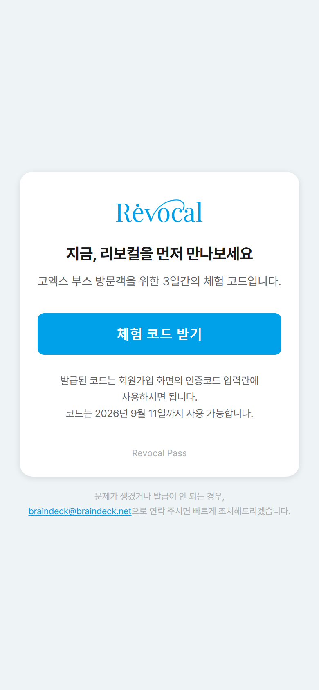
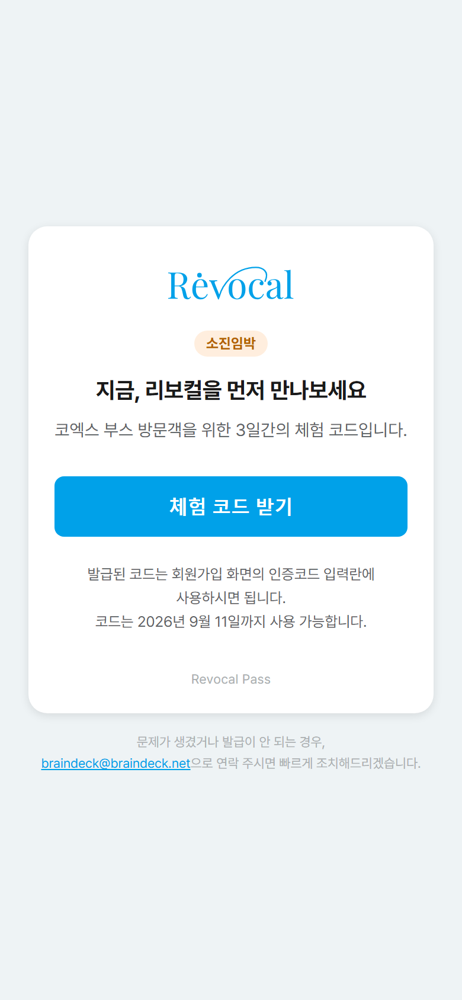
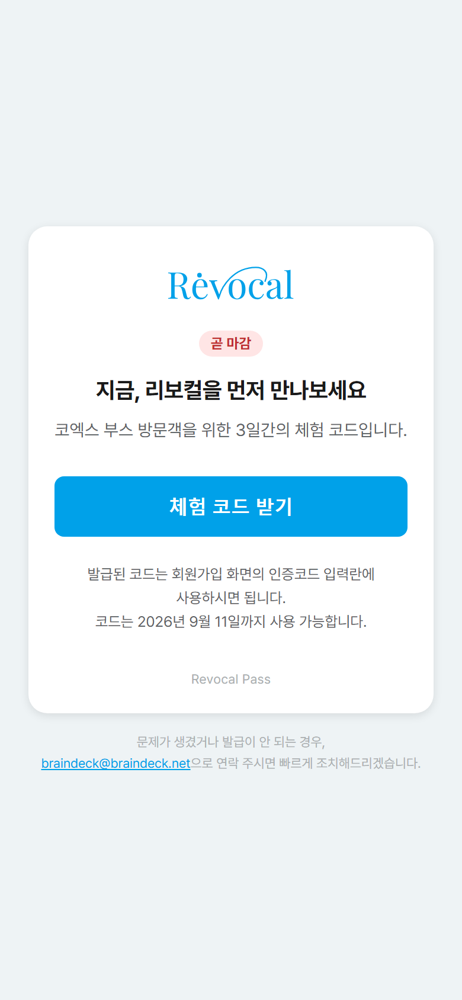
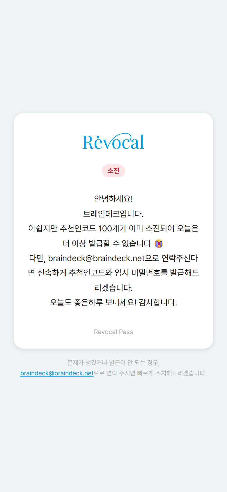
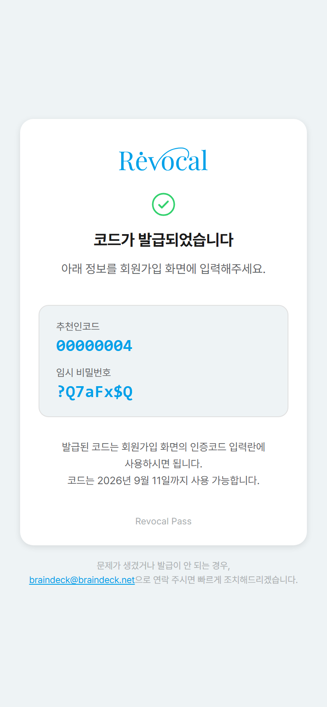
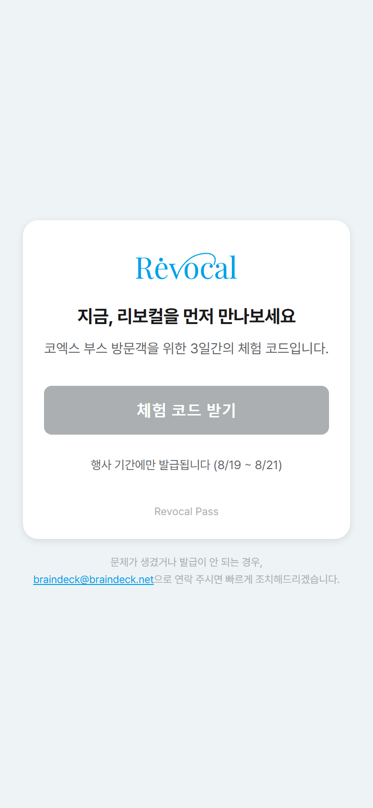

# Revocal Pass

**웹사이트**: https://braindeck-inc.github.io/revocal-pass/

코엑스 부스 방문객이 QR로 접속해서 버튼 하나로 리보컬 체험용 추천인코드 + 임시 비밀번호를 바로 받아가는 사이트.

## 어떻게 동작하나

- **하루 100개씩만 풀림.** 8/19(수)~8/21(금) 3일간만 버튼이 활성화되고, 그 외 날짜엔 버튼이 눌리지 않음.
- **못 쓴 수량은 다음날로 이월.** 첫날 100개 중 안 쓴 만큼 둘째 날 몫에 더해지고, 둘째 날 남은 것도 셋째 날로 그대로 넘어감. 3일 합쳐서 총 300개.
- **같은 브라우저면 하루 1번만.** 한 번 받으면 그 브라우저(기기)로는 그날 다시 눌러도 새 코드가 안 나가고, 처음 받았던 코드를 그대로 다시 보여줌 — 실수로 새로고침해도 코드가 안 바뀌거나 사라지지 않음.
- **봇/스크립트 방지.** 눈에 거의 안 보이는 캡챠(Cloudflare Turnstile)로 사람인지 확인하고, 페이지를 실제로 열어야만 발급 요청 자체가 가능하도록 처리해서 화면 없이 코드만 반복 호출하는 방식은 통하지 않음. 버튼을 사람이 누를 수 없는 속도로 누르면 자동 차단.
- **같은 와이파이를 써도 서로 안 막힘.** 발급 제한은 IP가 아니라 기기(브라우저) 기준이라, 부스에서 같은 와이파이 쓰는 옆자리 방문객끼리는 서로 영향 없음. IP 기준 제한은 짧은 시간에 지나치게 몰아서 요청하는 것만 걸러내는 보조 안전장치로만 작동.
- **코드 목록 자체는 어디에도 공개 안 됨.** 화면에 있는 어떤 파일에도 코드/비밀번호 목록이 들어있지 않고, 버튼을 누를 때마다 서버가 그 순간 하나만 꺼내서 보내줌.
- **100개 다 소진되면** 안내 문구로 자동 전환되고, 그 이후 요청은 더 이상 코드가 나가지 않음.

## 화면

| 발급 전 | 소진임박 | 거의 소진 |
|---|---|---|
|  |  |  |

| 매진 | 발급 완료 | 행사 기간 아님 |
|---|---|---|
|  |  |  |

## 구성

- `revocal-pass-site/` — 화면(GitHub Pages로 배포)
- `revocal-pass-worker/` — 코드 발급 서버(Cloudflare Worker)

## 참고

- 이번 행사는 300개 고정 수량으로 운영 — 소진된 코드 중 실제 가입 안 한 코드를 회수해서 재보충하는 기능은 이번엔 포함 안 함.
